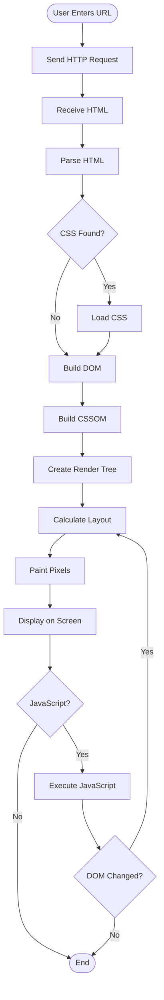

# Browser Rendering Process

## Overview

When you visit a website, your browser transforms HTML, CSS, and JavaScript into the visual page you see.

## The Rendering Pipeline

### 1. Fetch HTML
Browser requests and receives HTML from the server.

### 2. Build DOM
Parse HTML and create a tree structure of elements.

### 3. Build CSSOM
Download and parse CSS to understand styling rules.

### 4. Create Render Tree
Combine DOM and CSSOM, excluding hidden elements.

### 5. Layout
Calculate position and size of each element.

### 6. Paint
Draw pixels (text, colors, images) on screen.

## Activity Diagram

