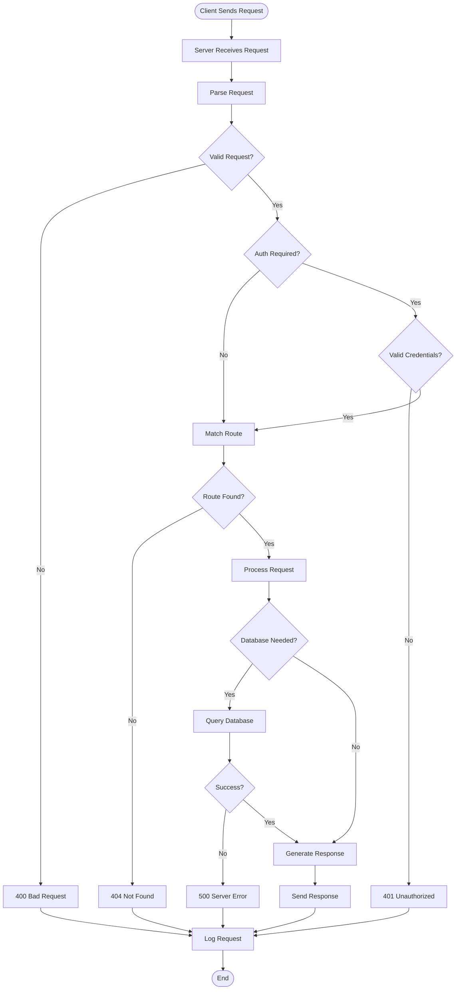

# HTTP Server Request Handling

## Overview

When a client sends a request to a server, the HTTP server processes it through several stages before sending back a response.

## The Request-Response Cycle

### 1. Receive Request
Server accepts connection and reads the HTTP request.

### 2. Parse Request
Extract method, URL, headers, and body data.

### 3. Authenticate & Authorize
Validate credentials and check permissions (if required).

### 4. Route Matching
Find the handler for the requested URL path.

### 5. Process Request
Execute business logic, query database, or call external APIs.

### 6. Generate Response
Prepare data, set status code and headers.

### 7. Send Response
Send the response back to the client and log the request.

## Activity Diagram

