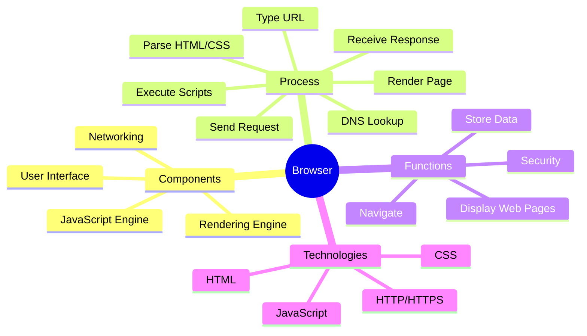

# How a Browser Works - Mindmap

## Browser Mindmap

---

## How a Browser Works (Explained)

### What is a Browser?

A browser is a program that lets you view websites on the internet. When you type a website address, the browser fetches information from a server and displays it in a readable format with text, images, videos, and interactive elements.

Think of it like a translator - it takes code (HTML, CSS, JavaScript) and turns it into the beautiful web pages you see.

### Main Parts of a Browser

**1. User Interface**  
This is everything you see and interact with:
- Address bar where you type URLs
- Back and forward buttons
- Bookmarks and tabs
- Refresh button

**2. Rendering Engine**  
The part that converts code into visual pages. Different browsers use different engines:
- Chrome and Edge use "Blink"
- Firefox uses "Gecko"
- Safari uses "WebKit"

**3. JavaScript Engine**  
Runs JavaScript code to make pages interactive (like buttons that respond when clicked, forms that validate, animations, etc.)

**4. Networking**  
Handles communication with servers on the internet. It sends requests and receives responses.

**5. Data Storage**  
Stores information on your computer like cookies, browsing history, cached files, and saved passwords.

### How the Browser Works: The Journey from URL to Web Page

When you visit a website, here's what happens behind the scenes:

**Step 1: You Type a URL**  
You enter something like `google.com` in the address bar or click a link.

**Step 2: DNS Lookup**  
The browser needs to find where Google's server is located. It uses DNS (Domain Name System) to convert `google.com` into an IP address (like `142.250.180.46`). Think of DNS like a phone book for the internet.

**Step 3: Send Request**  
The browser sends an HTTP or HTTPS request to that IP address asking for the webpage.

**Step 4: Server Response**  
The server sends back files:
- HTML file (structure of the page)
- CSS files (styling - colors, fonts, layout)
- JavaScript files (interactivity)
- Images, videos, and other media

**Step 5: Parsing**  
The browser reads and understands these files:
- HTML becomes the DOM (Document Object Model) - a tree structure of all page elements
- CSS becomes the CSSOM (CSS Object Model) - all styling rules

**Step 6: Rendering**  
The browser combines DOM and CSSOM to create a "Render Tree" - this is the blueprint for what goes where on the screen. Then it:
- Calculates exact positions and sizes (Layout)
- Paints pixels on your screen (Painting)

**Step 7: Execute JavaScript**  
JavaScript runs to add interactivity. The page becomes fully functional.

All of this happens in less than a second for most websites!

### What Browsers Do for You

**Display Content**  
Converts code into readable, visual web pages with text, images, videos, and interactive elements.

**Navigate**  
Lets you move between pages, go back and forward through history, open multiple tabs, and bookmark favorites.

**Store Information**  
Saves data locally:
- Cookies (small files websites use to remember you)
- Cache (temporary copies of files for faster loading)
- LocalStorage (data that websites save in your browser)
- Your browsing history and passwords

**Keep You Safe**  
- Uses HTTPS encryption to protect your data
- Warns you about dangerous websites
- Blocks pop-ups and malicious scripts
- Manages permissions (like camera, location access)

**Developer Tools**  
Provides tools for programmers to inspect, debug, and test websites.

### Technologies That Make Browsers Work

**HTML (HyperText Markup Language)**  
The skeleton - defines the structure of a web page (headings, paragraphs, images, links)

**CSS (Cascading Style Sheets)**  
The skin - controls appearance (colors, fonts, spacing, layout, animations)

**JavaScript**  
The muscles - adds interactivity and dynamic behavior (responding to clicks, updating content without reloading, animations)

**HTTP/HTTPS**  
The communication protocol - the language browsers and servers use to talk to each other. HTTPS is the secure version.

**DOM (Document Object Model)**  
The browser's internal representation of a webpage as a tree structure, which JavaScript can manipulate.

### Simple Analogy

Think of building a house:
- **HTML** is the bricks and structure
- **CSS** is the paint, furniture, and decoration
- **JavaScript** is the electricity that makes lights turn on when you flip switches
- **Browser** is the construction crew that puts it all together

The **server** is like a warehouse that stores the building materials, and the **internet** is the road that delivers them to your computer.
