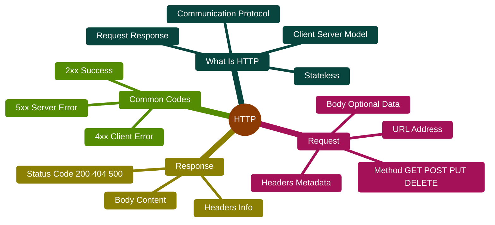

# How HTTP Works

## HTTP Mindmap



---

## How HTTP Works (Explained)

### What is HTTP?

HTTP stands for **HyperText Transfer Protocol**. It's the language that browsers and web servers use to talk to each other. Every time you visit a website, watch a video online, or submit a form, HTTP is working behind the scenes.

Think of HTTP like the postal service - it's the system that delivers messages (data) between your computer (client) and websites (servers).

### Key Concepts

**1. Protocol**  
A protocol is just a set of rules. HTTP is the rulebook that defines how computers should send and receive information on the web.

**2. Client-Server Model**  
- **Client**: Your browser (or app) that asks for information
- **Server**: The computer that has the information and responds

**3. Request-Response Cycle**  
HTTP works in a simple pattern:
1. Client sends a request ("Can I have this webpage?")
2. Server sends a response ("Here it is!" or "Sorry, not found")

**4. Stateless**  
HTTP doesn't remember previous requests. Each request is independent. It's like talking to someone with no memory - every conversation starts from zero.

(That's why websites use cookies to remember you!)

### The HTTP Request

When you type a URL and press Enter, your browser creates an HTTP request with these parts:

**1. Request Method**  
Tells the server what action you want:
- **GET** - "Give me this page" (most common)
- **POST** - "I'm sending you data" (form submissions)
- **PUT** - "Update this information"
- **DELETE** - "Remove this"

**2. URL (Uniform Resource Locator)**  
The address of what you want:
```
https://www.example.com/blog/article
```

**3. Headers**  
Extra information about the request:
- What browser you're using
- What type of content you accept
- Cookies from previous visits
- Your preferred language

**4. Body (Optional)**  
Data you're sending (like form data, uploaded files). Only used with POST, PUT, etc.

**Example Request:**
```
GET /blog/article HTTP/1.1
Host: www.example.com
User-Agent: Mozilla/5.0
Accept: text/html
Cookie: session=abc123
```

### The HTTP Response

The server sends back a response with these parts:

**1. Status Code**  
A 3-digit number telling you what happened:

**2xx - Success**
- **200 OK** - Everything worked! Here's your content
- **201 Created** - New resource was created successfully

**3xx - Redirection**
- **301 Moved Permanently** - This page has a new address
- **302 Found** - Temporary redirect to another page
- **304 Not Modified** - You already have the latest version (cached)

**4xx - Client Errors** (You made a mistake)
- **400 Bad Request** - Something's wrong with your request
- **401 Unauthorized** - You need to log in first
- **403 Forbidden** - You're not allowed to see this
- **404 Not Found** - This page doesn't exist
- **429 Too Many Requests** - Slow down, you're asking too fast!

**5xx - Server Errors** (Server's problem, not yours)
- **500 Internal Server Error** - Server had a problem
- **502 Bad Gateway** - Server got a bad response from another server
- **503 Service Unavailable** - Server is overloaded or down

**2. Response Headers**  
Information about the response:
- Type of content (HTML, JSON, image, etc.)
- Size of the content
- Caching instructions
- Cookies to save

**3. Response Body**  
The actual content - the HTML page, image, video, or data you requested.

**Example Response:**
```
HTTP/1.1 200 OK
Content-Type: text/html
Content-Length: 1234
Set-Cookie: session=xyz789

<html>
  <body>Here's your webpage!</body>
</html>
```

### How an HTTP Request Happens: Step by Step

Let's say you type `www.example.com/products` and press Enter:

**Step 1: Build the Request**  
Your browser creates an HTTP GET request asking for `/products`.

**Step 2: DNS Lookup**  
Browser finds the IP address of `example.com` (like finding a phone number).

**Step 3: Establish Connection**  
Browser connects to the server (TCP connection on port 80 for HTTP or 443 for HTTPS).

**Step 4: Send Request**  
Browser sends the HTTP request over the connection.

**Step 5: Server Processes**  
The server:
- Reads your request
- Finds the requested page
- Prepares the response

**Step 6: Send Response**  
Server sends back status code, headers, and the page content.

**Step 7: Browser Receives**  
Browser gets the response and displays the page.

**Step 8: Connection Closes** (or stays open for more requests)

All of this typically happens in less than a second!

### HTTP vs HTTPS

**HTTP (HyperText Transfer Protocol)**  
- Data is sent in plain text
- Anyone can read it if they intercept it
- Not secure
- Uses port 80

**HTTPS (HTTP Secure)**  
- Data is encrypted (scrambled)
- Much safer - protects passwords, credit cards, personal info
- Uses SSL/TLS encryption
- Uses port 443
- Shows a padlock icon in the browser

**Always use HTTPS for sensitive information!**

### HTTP Methods Explained

**GET**  
- Retrieve data
- No changes to server
- Can be bookmarked
- Example: Loading a webpage, searching Google

**POST**  
- Send data to server
- Creates new resources
- Cannot be bookmarked
- Example: Submitting a form, posting a comment, uploading a file

**PUT**  
- Update existing resources
- Replaces the entire resource
- Example: Updating your profile information

**DELETE**  
- Remove resources
- Example: Deleting a post, removing an item from cart

**PATCH**  
- Partial update (not full replacement)
- Example: Changing just your email, not your whole profile

**HEAD**  
- Like GET, but only gets headers (no body)
- Example: Checking if a file exists without downloading it

### Common HTTP Headers

**Request Headers:**
- `User-Agent`: What browser/app you're using
- `Accept`: Types of content you can handle
- `Cookie`: Saved data from previous visits
- `Authorization`: Your login credentials
- `Referer`: What page you came from

**Response Headers:**
- `Content-Type`: What kind of data is being sent
- `Content-Length`: How big the data is
- `Set-Cookie`: Save this data for next time
- `Cache-Control`: How long to keep this cached
- `Location`: Where to redirect (for 3xx codes)

### Simple Analogy

Think of HTTP like ordering food at a restaurant:

**Request:**
- **Method**: "I'd like to order" (GET) or "I'll take this to go" (POST)
- **URL**: "Table 5, Menu item #12"
- **Headers**: "I'm allergic to nuts, prefer spicy, party of 4"
- **Body**: Special instructions or customizations

**Response:**
- **Status Code**: "Order ready!" (200) or "We're out of that" (404)
- **Headers**: "Contains dairy, serves 2, ready in 10 minutes"
- **Body**: The actual food you ordered

The waiter is HTTP - delivering your request to the kitchen (server) and bringing back the response (food)!

### Why HTTP Matters

- **Foundation of the Web**: Every webpage, API, and web service uses HTTP
- **Simple**: Easy to understand and implement
- **Flexible**: Can transfer any type of data
- **Universal**: Works across all devices and platforms
- **Stateless**: Each request is independent, making it scalable

Understanding HTTP helps you:
- Debug website problems
- Build web applications
- Understand why pages load slowly
- Know when an error is your fault or the server's
- Use web APIs effectively
